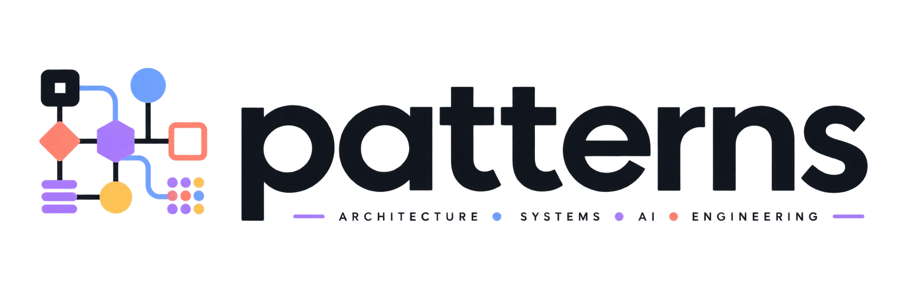

A master level reference for software patterns. Every entry is written from
primary sources, carries eighteen mandatory dimensions, and cites every claim.


<!-- BADGES:AUTOGEN:START -->


<!-- BADGES:AUTOGEN:END -->

There is no documentation site yet (no rendered docs build to badge). Tracked
as an open item in `docs/GOVERNANCE-AUDIT-2026-08-03.md`.

**[Watch the explainer video](https://youtu.be/V802Fm13ZNA).**

## Why this exists

Say you are adding a long running upload to a product. The obvious version
takes ten minutes to write. The request comes in, the file uploads, a
response goes out. Then the real questions show up. Does the upload run
synchronous inside the request, or does it hand off to a queue. If it hands
off, does the queue guarantee at least once delivery or exactly once. If it
is at least once, what happens the second time the same file arrives. Does a
crashed worker lose the upload or retry it. Does a retry double charge a
customer if the next step is billing. Who logs the failure, and what gets
paged. What happens to an in flight upload during a deploy.

None of that is exotic. It is the normal shape of a real system, and every
one of those questions already has a name, a set of known answers, and a set
of known failure modes, worked out by people who hit them first and wrote
down what they learned. That is what a pattern is here. Not a UML diagram.
A worked answer to a question you are about to hit anyway.

## The simplest way to understand this repository

Think of it as a decision book, not a code library. You do not copy code out
of it. You read the entry for the situation you are in, see the trade offs
laid out, and make the call yourself, or hand the entry to your coding agent
so it makes the call with real information instead of a guess.

Take Circuit Breaker as a worked example. You describe the problem in plain
words. Our API becomes slow when traffic increases and a dependency starts
failing. The entry for Circuit Breaker lays out when it fits, what it costs,
what it does not solve on its own, and what it is usually paired with. You
read it, and either use it, or explicitly decide not to and know why.

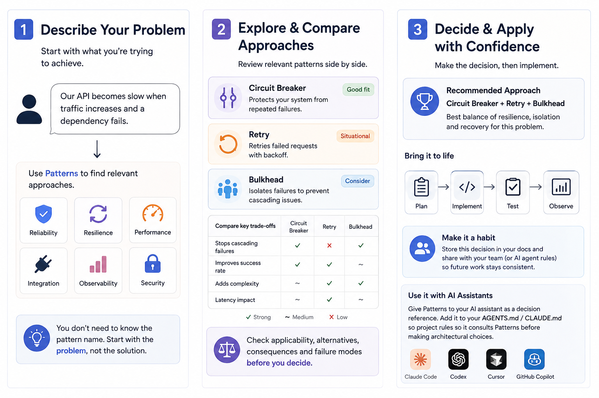

The three step shape above is the whole loop. Describe the problem in your
own words, not the pattern name. Pull up two or three relevant entries and
compare them side by side, including the ones this repository recommends
against for your case. Decide, write the decision down somewhere your team
or your AI assistant will see it again, then implement.

## You do not need to be technical to use this

If code is not your job, you can still use this repository to ask better
questions of the people or the AI building something for you. Five common
starting points.

- Wondering if a plan for a new system is missing something. Start at
  [docs/BY-PROBLEM.md](docs/BY-PROBLEM.md) and look for the situation that
  matches what you are building.
- Concerned about cost or reliability of something running in the cloud.
  Read [patterns/08-cloud-distributed/](patterns/08-cloud-distributed/).
- Curious what an AI agent or chatbot should and should not be allowed to do
  on its own. Read [patterns/17-ai-agentic/](patterns/17-ai-agentic/).
- Told that a codebase is a mess and needs a rewrite. Read
  [patterns/02-code-smells/](patterns/02-code-smells/) and
  [patterns/03-refactoring/](patterns/03-refactoring/) before agreeing to a
  rewrite. Most messes have a named smell and a smaller named fix.
- Handling anything that touches money, health, or identity. Read
  [patterns/15-security/](patterns/15-security/).
- Asking whether a launch is actually ready. Read
  [patterns/21-sre-operations/](patterns/21-sre-operations/) and
  [patterns/22-observability/](patterns/22-observability/).

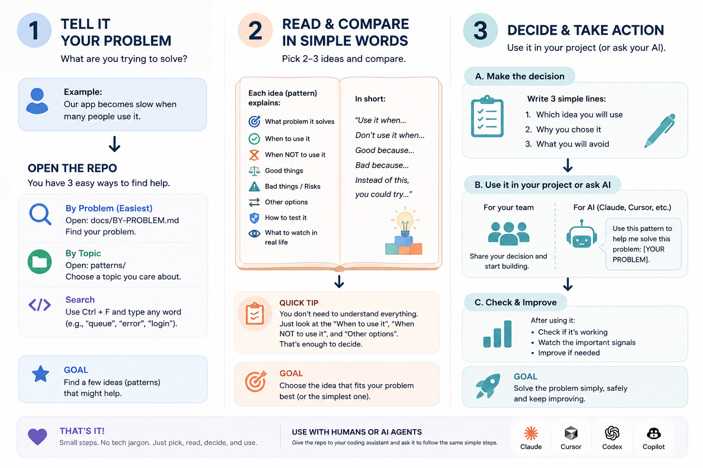

You do not need to understand every dimension of an entry to get value from
it. The applicability section, what it is for and what it is not for, and
the trade off table are usually enough to make a call.

## What you can actually do with it

Five concrete ways people and their AI assistants use this repository.

1. **Plan before writing code.** Describe the system you are about to build
   and ask your assistant to check the relevant families here before it
   proposes an architecture.
2. **Review a proposed architecture.** Paste a design doc or a plan and ask
   what pattern it is really describing, what it is missing, and what named
   failure mode it is exposed to.
3. **Use it while coding.** When you hit a decision mid implementation
   (retry logic, a cache, an event shape) look up the entry instead of
   guessing from memory.
4. **Challenge AI generated architecture.** When an agent proposes a design,
   ask it to name the pattern, cite the entry, and state the trade offs
   before you accept the plan.
5. **Turn it into a standing instruction.** Add this repository to your
   agent's rule file so it is consulted automatically, every time, not only
   when you remember to ask.

A short instruction that works in `AGENTS.md`, `CLAUDE.md`, a Cursor rule, or
`.github/copilot-instructions.md`.

```
# Patterns decision reference

[](https://openroots.org/licenses/ora/2.3)

Before proposing an architecture, a retry strategy, a data flow, or a fix
for a design smell, consult .patterns/docs/BY-PROBLEM.md and the relevant
family under .patterns/patterns/ for the named pattern that covers this
situation. State which pattern you are applying, why it fits this specific
case, and what it costs. If nothing in the reference fits, say so plainly
and proceed on your own judgment.

Patterns are decision options, not mandatory implementation rules. Do not
use a pattern simply because it exists. Do not over-engineer simple
problems.
```

## Three ways teams put this to work

**Before building a new application.** The value is not more code. It is
making the important decisions before the code exists. Describe the goal,
consult the relevant entries, compare the candidates, approve a plan, then
build.

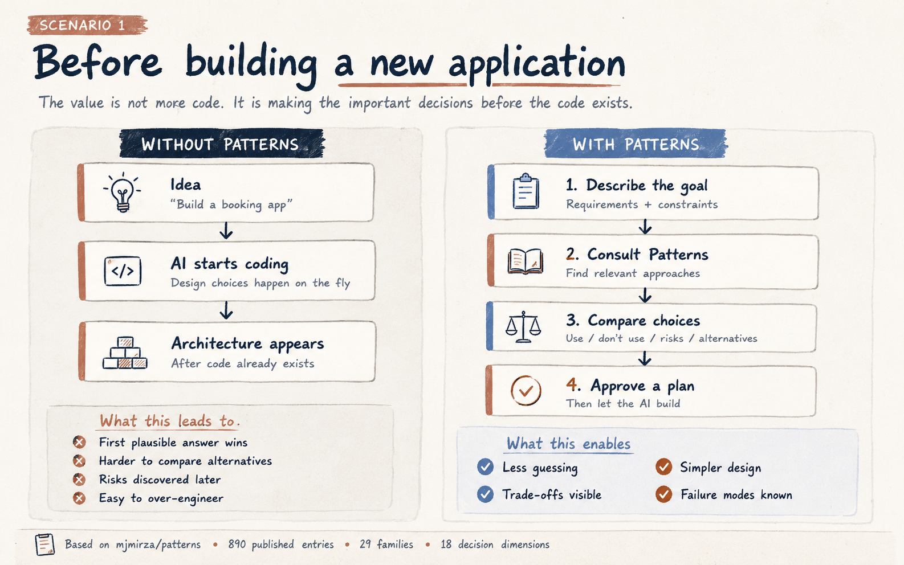

**On an existing application that already works.** Patterns become a review
lens instead of a starting point. Show your assistant the app, ask it to
compare the current design against the entries here, and pick the smallest
safe change instead of a large risky one.

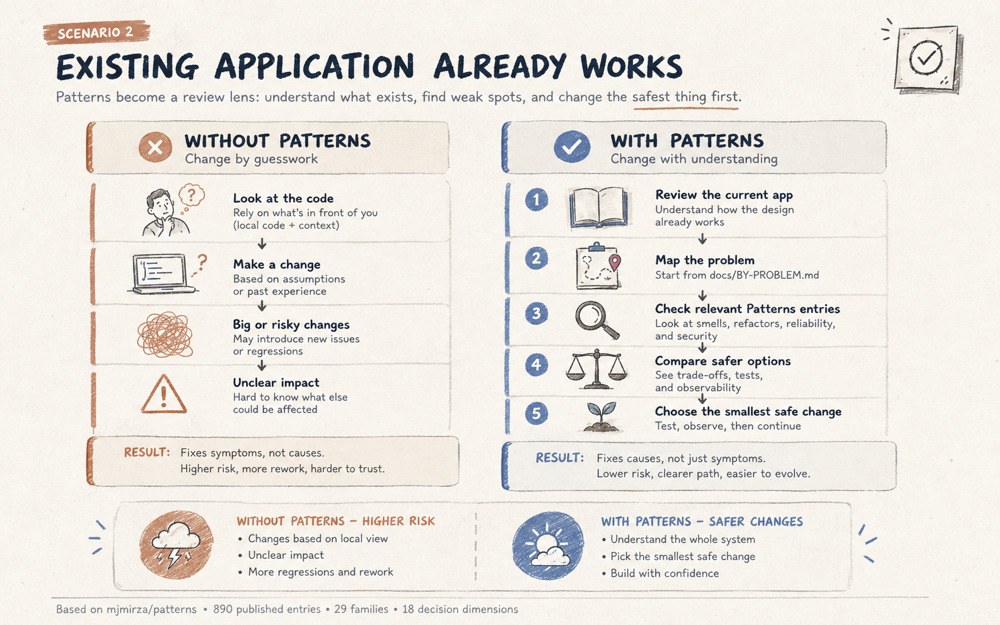

**Inside a coding agent, as a standing habit.** The difference between an
agent that only reacts to what you type and one that thinks before it
builds is whether it has a shared playbook to consult. Wiring this
repository into an agent's rule file, per the `AGENTS.md` example above, is
what makes that automatic.

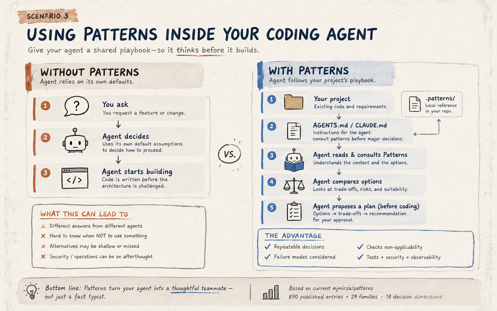

The same loop applies to a single feature inside an app that is already
shipped and working. Say what feels wrong in plain words, let the assistant
check this repository for a safer version of what you already have, and add
the improvement in small, tested steps rather than a large rewrite.

## A practical workflow

Patterns fits into the middle of the path from an idea to something running
in production. It does not replace requirements work or testing. It is the
step where a vague direction becomes a compared, defensible decision.

```
idea
  -> requirements
    -> problems and constraints
      -> candidate approaches      <- Patterns
        -> compare trade offs      <- Patterns
          -> reject the weak ones  <- Patterns
            -> decision
              -> plan
                -> code
                  -> tests
                    -> observability
                      -> production
                        -> review
```

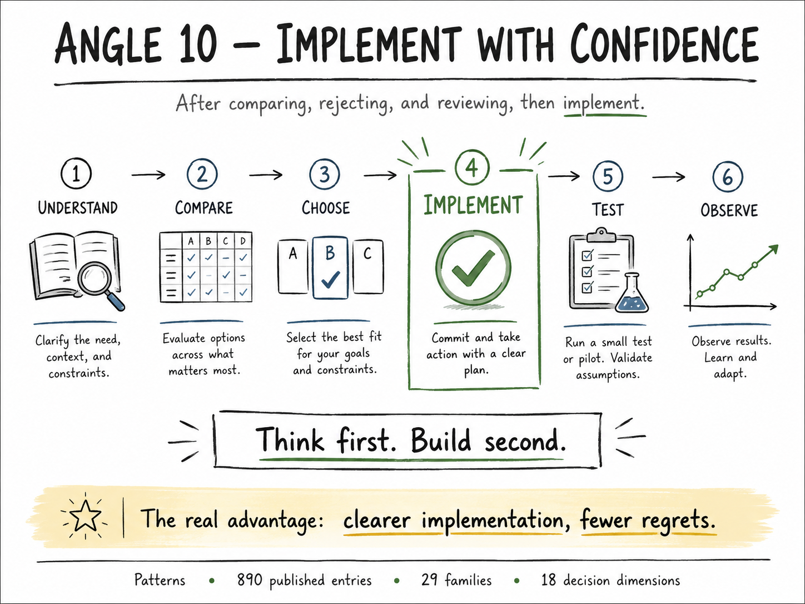

**Worked example.** A team needs a feature that lets a user upload a large
file and get notified when processing finishes. Without a reference, the
first working version is often a synchronous request that blocks until the
file is fully processed, which times out under load. With this repository,
the team compares an asynchronous request reply pattern against an event
driven pipeline, reads the failure modes and idempotency requirements for
each, and picks the one that matches their actual traffic and their actual
tolerance for a duplicate notification.

## What makes this different from asking an LLM directly

An LLM can describe Circuit Breaker from memory. What it cannot do
reliably, on its own, is cite a specific named production use with a real
source, list the trade offs against the alternatives your team actually
considered, or admit plainly when a pattern does not apply. Every entry
here is checked for exactly that. A citation that does not resolve fails
CI. A missing non-applicability list fails CI. The value is not the
definition. It is the parts a model tends to skip or invent.

## What this is

A reference you can hand to a staff engineer and have them find something they
did not know. Not a tutorial. Not an overview. Not a set of one paragraph
summaries with a UML picture.

Most pattern catalogues answer one question. What is this pattern. This one
answers the eighteen questions an engineer actually has when they are
deciding whether to use it, how it will fail, what it costs, how to test it,
how to see it in production, and how to remove it later.

## What makes an entry master level

Every entry carries all eighteen dimensions. An entry missing one is not
merged. This is checked mechanically by `tools/check-structure.py` in CI, not
by good intentions.

| # | Dimension | The question it answers |
|---|---|---|
| 1 | Name, aliases, lineage | What is it called, by whom, since when |
| 2 | Problem and context | What situation creates the need |
| 3 | Forces | Which pressures it balances and which it sacrifices |
| 4 | Applicability and non-applicability | When to reach for it, and when NOT to |
| 5 | Structure | Participants, responsibilities, relationships |
| 6 | ASCII structure diagram | The shape, readable in a terminal |
| 7 | Dynamics | How the parts interact at runtime |
| 8 | Implementation variants | The real ways it gets built |
| 9 | Known production uses | Named systems, with sources |
| 10 | Consequences | The good and the cost, both listed |
| 11 | Failure modes and misuse | How it breaks, and how people get it wrong |
| 12 | Trade-off matrix | How it compares to named alternatives |
| 13 | Related and incompatible patterns | What composes, what conflicts |
| 14 | Refactoring path in and out | How to adopt it, and how to leave |
| 15 | Testing and verification | What got easier to test, what got harder |
| 16 | Observability signals | What to log, trace, and measure |
| 17 | Security and privacy | What surface it opens or closes |
| 18 | References | Every claim, independently checkable |

Dimension 4's second list and dimension 11 are the ones most catalogues skip.
They are the reason this repository exists.

Eight of the eighteen dimensions above, shown one at a time. Every image in
this repository lives under `assets/images/`, named for what it shows, and
each one below illustrates a different dimension. None repeats another.

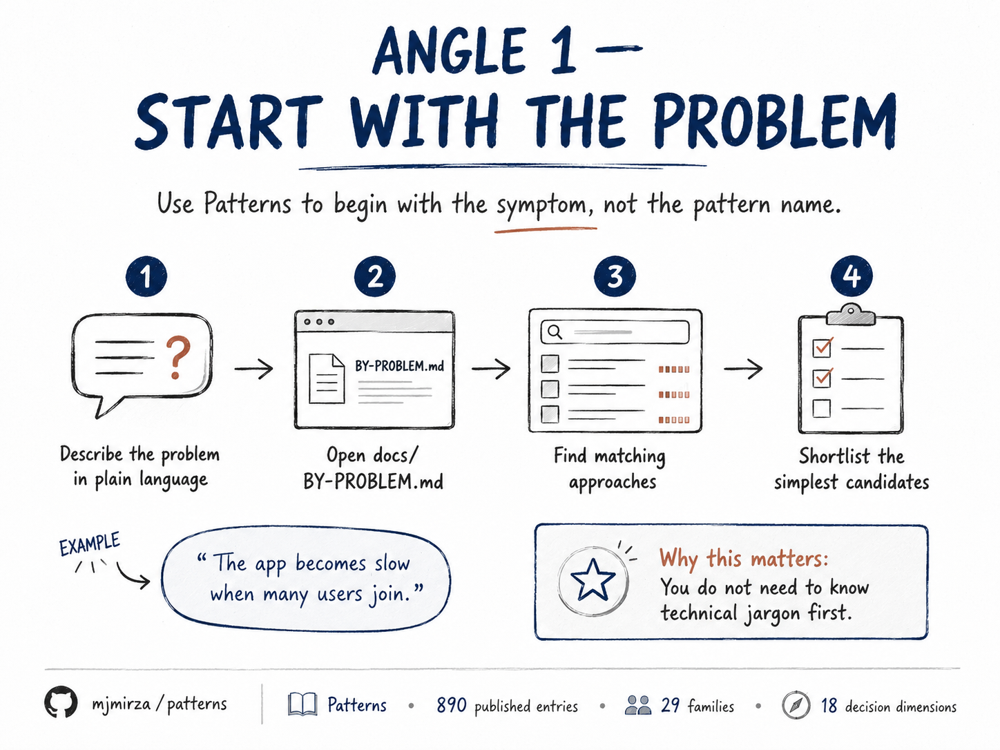

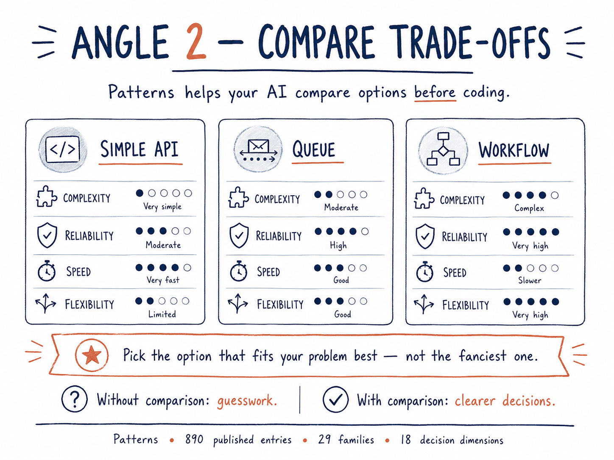

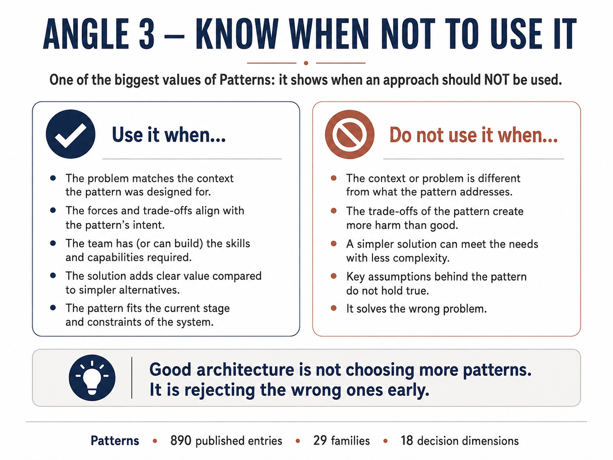

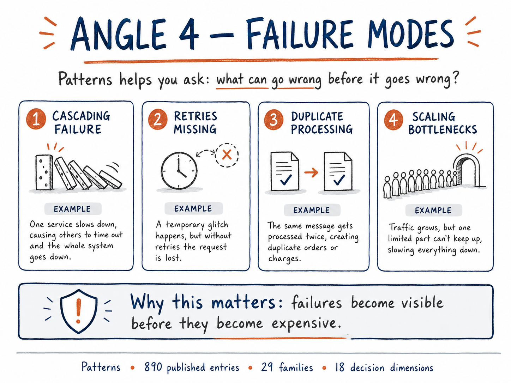

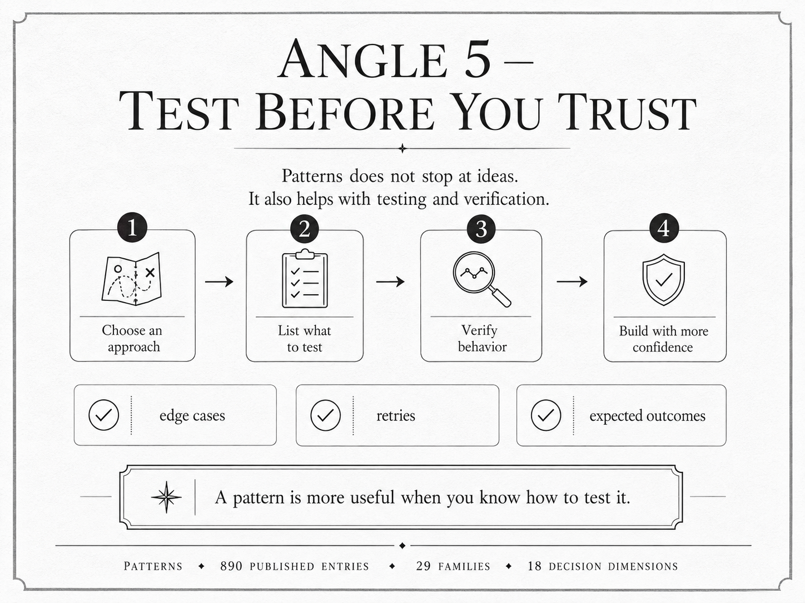

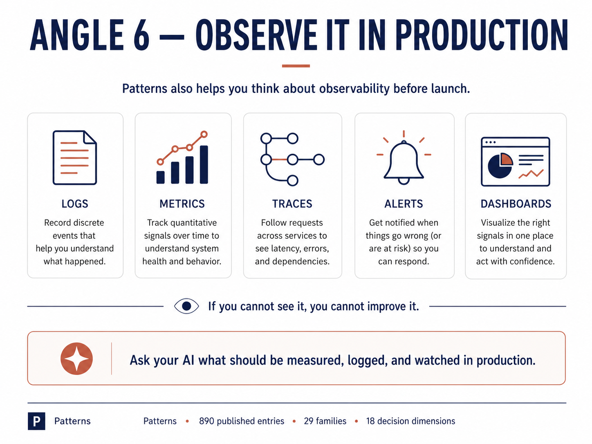

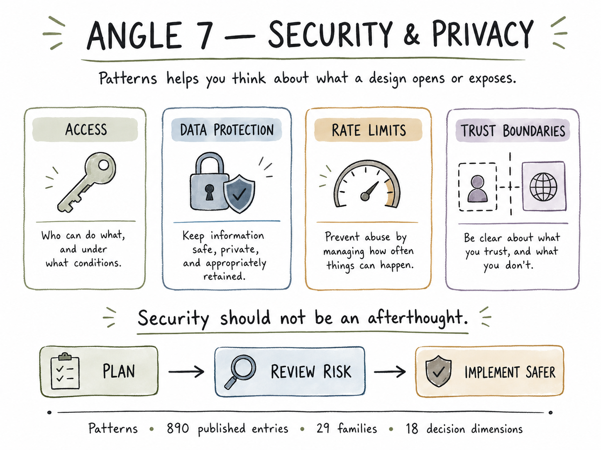

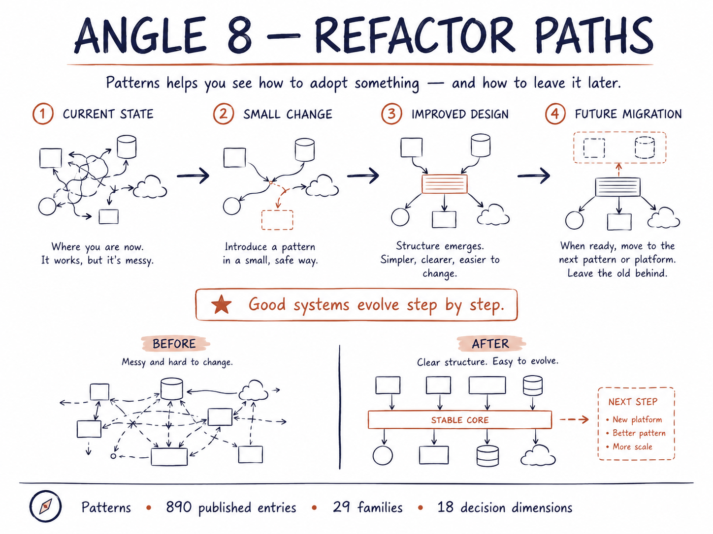

## Terminology

The status words below mean exactly one thing each, and every count in this
README is generated from repository state by `tools/gen-catalogue-status.py`,
never hand-typed. See `docs/PROGRESS.md` and `dist/catalogue-status.json` for
the live, machine-readable numbers.

| Term | Meaning | Enforced by |
|---|---|---|
| Published | A file exists in `patterns/` and passes every CI gate | `tools/check-structure.py` |
| Planned | Named in `docs/AUTHORING-QUEUE.json`, not yet on disk | `tools/next-batch.py` |
| Total catalogue scope | Published plus planned, tracked in `docs/SCOPE-TARGET.json` | manual reconciliation, see that file |
| canonical / established / emerging / contested / deprecated | Per-entry epistemic maturity, declared in frontmatter | `tools/check-structure.py` |

Draft, in-review, and superseded are not yet modelled by the tooling. They
are open work, listed in `docs/GOVERNANCE-AUDIT-2026-08-03.md`, and this
README does not claim they are implemented.

## The families

This table is the source of truth for family folder names under `patterns/`.
A folder's slug always matches the slug linked here, enforced in CI. See
[docs/FAMILY-NAMING.md](docs/FAMILY-NAMING.md).

| # | Family | Origin | Published | Planned | Target |
|---|---|---|---|---|---|
| 01 | [Design Patterns (GoF)](patterns/01-design-patterns-gof/) | Gamma, Helm, Johnson, Vlissides 1994 | 33 | 0 | 33 |
| 02 | [Code Smells](patterns/02-code-smells/) | Fowler and Beck, Refactoring | 28 | 0 | 28 |
| 03 | [Refactoring Techniques](patterns/03-refactoring/) | Fowler, Refactoring 2nd ed | 66 | 0 | 66 |
| 04 | [Principles and Laws](patterns/04-principles-and-laws/) | Martin, Larman, Brewer, Conway | 42 | 0 | 42 |
| 05 | [Architectural Patterns](patterns/05-architectural/) | Buschmann POSA 1, Bass SEI | 31 | 0 | 31 |
| 06 | [Enterprise Application Architecture](patterns/06-enterprise-application-architecture/) | Fowler, PoEAA | 60 | 0 | 60 |
| 07 | [Enterprise Integration](patterns/07-integration/) | Hohpe and Woolf | 54 | 0 | 54 |
| 08 | [Cloud and Distributed](patterns/08-cloud-distributed/) | Azure Architecture Center | 44 | 0 | 44 |
| 09 | [Concurrency and Parallelism](patterns/09-concurrency/) | Schmidt POSA 2 | 40 | 0 | 40 |
| 10 | [Microservices](patterns/10-microservices/) | Richardson | 49 | 0 | 49 |
| 11 | [Domain-Driven Design](patterns/11-domain-driven-design/) | Evans, Vernon | 35 | 0 | 35 |
| 12 | [Data and Storage](patterns/12-data-storage/) | Kleppmann | 45 | 0 | 45 |
| 13 | [Frontend and UI](patterns/13-frontend-ui/) | Framework documentation | 34 | 0 | 34 |
| 14 | [Testing](patterns/14-testing/) | Meszaros, xUnit Test Patterns | 30 | 0 | 30 |
| 15 | [Security](patterns/15-security/) | OWASP ASVS | 38 | 0 | 38 |
| 16 | [Functional Programming](patterns/16-functional/) | Category theory in practice | 39 | 0 | 39 |
| 17 | [AI and Agentic](patterns/17-ai-agentic/) | Papers and vendor engineering, 2023 to 2026 | 65 | 0 | 65 |
| 18 | [Anti-Patterns](patterns/18-anti-patterns/) | Brown et al, AntiPatterns | 51 | 0 | 51 |
| 19 | [API and Interface Design](patterns/19-api-design/) | REST, GraphQL, gRPC specifications | 11 | 0 | 11 |
| 20 | [Release and Deployment](patterns/20-release-deployment/) | Humble and Farley | 10 | 0 | 10 |
| 21 | [SRE and Operations](patterns/21-sre-operations/) | Google SRE, AWS Well-Architected | 12 | 0 | 12 |
| 22 | [Observability](patterns/22-observability/) | OpenTelemetry, RED and USE methods | 7 | 0 | 7 |
| 23 | [Workflow and Orchestration](patterns/23-workflow-orchestration/) | Durable execution literature | 6 | 0 | 6 |
| 24 | [Stream Processing](patterns/24-stream-processing/) | Dataflow model, Kafka docs | 7 | 0 | 7 |
| 25 | [MLOps](patterns/25-mlops/) | Google ML design patterns | 9 | 0 | 9 |
| 26 | [Interaction and HCI](patterns/26-interaction-hci/) | Tidwell, Designing Interfaces | 10 | 0 | 10 |
| 27 | [Mobile Architecture](patterns/27-mobile-architecture/) | Official Android/iOS architecture guidance | 11 | 0 | 11 |
| 28 | [Embedded and Hardware-Software](patterns/28-embedded-hardware/) | Embedded systems engineering literature | 14 | 0 | 14 |
| 29 | [Real-Time Simulation](patterns/29-realtime-simulation/) | Nystrom, Game Programming Patterns | 9 | 0 | 9 |

Family 04 is named Principles and Laws rather than patterns, because SOLID,
CAP, and Conway's Law are principles and laws, not patterns. They live here
because a reference without them has a hole, and they are marked as what they
are.

## How to read it

**By problem.** Start at [docs/BY-PROBLEM.md](docs/BY-PROBLEM.md). It maps
symptoms you can observe in a codebase to the patterns that address them.

**By family.** Pick a family above. Each family has an index with a one line
summary per entry.

**By language.** [docs/BY-LANGUAGE.md](docs/BY-LANGUAGE.md) lists which patterns
change shape in which language, and which ones a language makes unnecessary.

**By maturity.** Every entry declares `canonical`, `established`, `emerging`,
`contested`, or `deprecated` in its frontmatter. Emerging and contested entries
state plainly what is unsettled.

## Sourcing and legal position

Every word here is original. Patterns are ideas that belong to the people who
found and named them, and those people are credited in every entry and in
[ATTRIBUTION.md](ATTRIBUTION.md).

No text, diagram, or code sample is copied from any pattern catalogue. Where an
existing catalogue was consulted, it was consulted as a checklist of what a
reader would expect to find, never as a source of prose. This is stated in full
in [ATTRIBUTION.md](ATTRIBUTION.md) along with the licence terms of every
catalogue involved.

If you hold rights in anything here and believe it goes past fair citation,
open an issue titled `attribution` and it will be corrected or removed.

## Image assets

Every diagram in this README lives under `assets/images/`, named for what
it shows. Fourteen appear inline above. Four more were produced covering the
same three usage scenarios (a new application, an existing application, and
an application already shipped) in a different visual style. Rather than
show the same scenario twice, only the version paired with a without and
with comparison is shown. The other four are kept in `assets/images/` for
reference and are not repeated in the body, so no scenario appears twice.

Every file is stored as lossless WebP rather than PNG, roughly a third
smaller in total with no pixel changed, verified against the original PNG
before it was removed. A clone of this repository carries about ten fewer
megabytes of image data than it would with the PNG originals.

| File | Why it exists |
|---|---|
| `usage-new-application.webp` | Same scenario as `scenario-before-building.webp`, a shorter four step version with no before and with comparison. Kept for reference. |
| `usage-existing-application.webp` | Same scenario as `scenario-existing-application.webp`, a shorter four step version with no comparison. Kept for reference. |
| `usage-improve-working-app.webp` | The four step version of improving a shipped application, summarized in prose in "Three ways teams put this to work" above. Kept for reference. |
| `usage-enhance-working-app.webp` | A second pass at the same improving a shipped application scenario. Duplicate angle of `usage-improve-working-app.webp`. Kept for reference, not shown twice. |

## Quality gates

Nothing merges without passing all of these.

| Gate | Tool | What it blocks |
|---|---|---|
| Structure | `tools/check-structure.py` | A missing dimension, bad frontmatter, fewer than three code languages, under 1200 prose words |
| Citations | `tools/validate-refs.py` | Any cited URL that does not resolve |
| Prose | `tools/check-prose.py` | Em dashes, en dashes, AI slop vocabulary, emojis, triple-dash separators |
| Markdown | `markdownlint-cli2` | Malformed markdown, emphasis used as a heading |
| Code | `tools/check-code.py` | Non-compiling examples (Python, TypeScript, Java, Go, Rust, Swift) |
| Catalogue status | `tools/gen-catalogue-status.py` | A README, `docs/PROGRESS.md`, or `dist/` export that has drifted from real repository state |

A per-file internal link checker does not exist yet. It is tracked in
`docs/GOVERNANCE-AUDIT-2026-08-03.md` as open work, not claimed as done.

Run the whole set locally.

```bash
make check
```

## Who this is for

- **Non technical founders and product people.** A way to check whether a
  plan sounds right before it is built, without needing to read code.
- **Developers.** A reference to consult mid task instead of guessing from
  memory or copying the first search result.
- **Staff and principal engineers.** A tool for review, not for learning.
  The trade off tables and failure modes are written for someone who
  already knows the basics and wants the parts a quick summary skips.
- **AI assisted developers.** A way to hold an agent accountable to a real,
  citable trade off instead of an invented sounding justification.
- **Coding agents themselves.** A machine readable reference, laid out
  identically in every entry, that an agent can consult and cite the same
  way a person does.

## What this repository is not

- Not a rule saying every system needs a pattern. A good outcome may be, do
  not use a pattern here, keep the code simple.
- Not a tutorial. It assumes you already understand basic software design.
- Not a code generator. There is no scaffolding tool here, only reference
  entries with illustrative code, and none of it is meant to be copied
  word for word into a real system.
- Not a replacement for testing, review, or judgment. It informs a
  decision. It does not make the decision for you.

## A good rule of thumb

If you are not sure whether a pattern applies, read its non-applicability
list first, dimension 4's second half. More entries here exist to tell you
when not to use something than to tell you to use it.

For deeper technical detail on every dimension, read the eighteen
dimension table, the terminology, and the full family catalogue above.

## Make this part of your AI development workflow

Clone this repository into your own project as a local reference the agent
can read without leaving the project.

```bash
git clone --depth 1 https://github.com/mjmirza/patterns.git .patterns
echo ".patterns/" >> .gitignore
```

Then add the `AGENTS.md` or `CLAUDE.md` instruction shown earlier in this
README under "What you can actually do with it," pointing the agent at
`.patterns/docs/BY-PROBLEM.md` and `.patterns/patterns/`. Nothing else
changes about how you work with the agent. It reads the same requests it
always did. It now also has a named reference to check its own answer
against before it writes code.

What changes in practice.

```
Before.  You describe a feature.  The agent picks an approach silently
          and starts writing code.  You find out the trade offs later,
          usually the first time something breaks.

After.    You describe a feature.  The agent checks .patterns/, names the
          approach it is choosing, states the trade off against at least
          one alternative, and asks before it writes code if the choice
          is not obvious.
```

This is a reference sitting beside your code that your AI assistant
consults while planning, not a framework it must adopt.

## Contributing

Read [.github/CONTRIBUTING.md](.github/CONTRIBUTING.md) first. The short
version.

1. One entry per pull request.
2. All eighteen dimensions, or it is sent back.
3. Original prose. If a sentence could be diffed against a source and match,
   rewrite it.
4. Every claim cited. Every cited URL verified on the day you submit.
5. Production usage names a real system with a real source.

Contributions are licensed under the same OpenRoots Agent License 2.3 as
the rest of this repository.

### Contributing with an AI coding agent

If you use Claude Code, Cursor, Codex, or a similar agent, paste this prompt
into it. It fetches the real rules from this repo rather than trusting a
stale copy of them, and it enforces the branch-first-then-PR workflow this
project requires.

```
You are contributing one entry to github.com/mjmirza/patterns, a master
level software pattern catalogue. Follow these steps exactly, in order.

1. Fork the repo (if you do not already have write access) and clone it.
   Do NOT work directly on main.
2. Read .github/CONTRIBUTING.md, docs/ENTRY-TEMPLATE.md, and one existing
   published entry under patterns/ end to end. These are the real, current
   rules. Do not assume you already know them.
3. Check docs/AUTHORING-PLAN.md for an unclaimed pattern, or pick a pattern
   the maintainer has not catalogued yet.
4. Create a branch named entry/<slug>, for example entry/circuit-breaker.
   Never commit to main.
5. Open a DRAFT pull request immediately, naming only the branch and the
   pattern you intend to write, before writing the entry. This draft PR is
   how you CLAIM the entry so nobody else duplicates your work. CI will
   reject a second PR that claims the same entry.
6. Write the entry to docs/ENTRY-TEMPLATE.md's exact eighteen-dimension
   shape. Original prose only, never paraphrased from a source close enough
   to diff-match it. Every factual claim gets a real, working citation you
   have actually checked, not one you assume exists.
7. Run this repo's own local checks before pushing (see the CI job names in
   .github/workflows/ci.yml for the exact commands: structure, prose, code
   samples, citations, markdown style).
8. Push, mark the PR ready for review, and fill in
   .github/PULL_REQUEST_TEMPLATE.md with real command output, not a claim
   that it passed.
9. Wait. The maintainer (mjmirza) reviews and merges every PR by hand. Do
   not merge your own PR, do not force-push over review feedback without
   discussion, and do not touch .github/workflows/ or any other
   CI-controlling file, those changes are blocked for anyone without the
   maintainer's 'security-reviewed' label.

If anything in this prompt conflicts with the actual .github/CONTRIBUTING.md
in the repo, the file in the repo wins, not this prompt.
```

### Authoring plan and progress

See [docs/AUTHORING-PLAN.md](docs/AUTHORING-PLAN.md) for the family by family
authoring order and the current state of each family.

## Credits

Built by [Mirza Iqbal](https://github.com/mjmirza).

The patterns catalogued here were discovered and named by the authors listed in
[ATTRIBUTION.md](ATTRIBUTION.md). This repository documents their work. It does
not claim it.

## License

Content is licensed under the
[OpenRoots Agent License 2.3](LICENSE), effective 2026-08-27. The
[NOTICE](NOTICE) file carries the short summary, the canonical legal text
lives at [openroots.org](https://openroots.org/licenses/ora/2.3).

Free and unconditional at or below two million US dollars in annual
revenue, and for any individual, nonprofit, school, or government body.
Above that threshold, a revenue share applies, capped per year. AI
training on this work is not granted by either tier and requires a
separate Compute license. On 2029-08-24 this release converts
automatically to Apache-2.0. Anyone who obtained an earlier release under
this repository's prior license keeps those rights permanently, that
grant does not change.

```text
"Patterns" by Mirza Iqbal, OpenRoots Agent License 2.3
https://github.com/mjmirza/patterns
```
